# Systems and Software
# Kade, Pitsch(t12r458)
# kadecarter82@gmail.com
# CSCI 476
# 02/02/2021

## Task 1: Manipulating Environment Variables

### Task 1.1: printenv
`Printenv` or `env` can be used to print out the environment variables and the `grep` command can be used to
view particular variables.
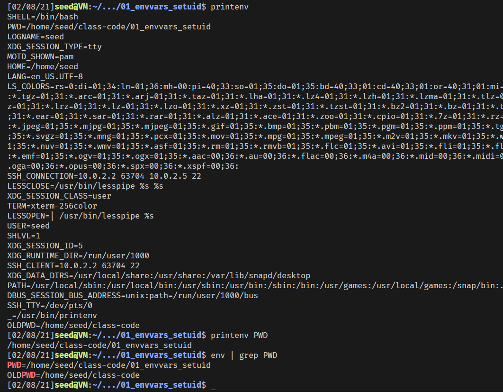

### Task 1.2: `export`and `unset`
We can use the `export` command to set the specific environment varaiables and use `unset` to remove the environment variables

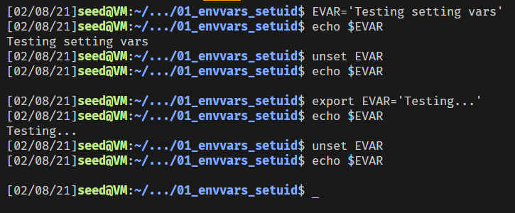

## Task 2: Passing Environment Variables
After compiling both programs one prints the child process and then we can uncomment and recompile to get the 
print out of the parent environment variables. After we have ran both versions we can call `vimdiff childFile parentFile` to
check and see if there are any differences in the file but it turns out that they are exactly the same. The reason that they are the same is because the child process inherits all the parents environment variables, the only difference being that the two
processes have different PID's
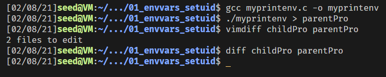

## Task 3: Environment Variables and `execve()`
Running the program w/NULL we get no output but after inputing the `environ` into the `execve(...)` call we get the
environment variables output. We can get the environment variable by inputting the Address pointer to the environment.

### Task 3.1
It does not look like anything runs when the code is `execve(argv[0], argv, NULL);`
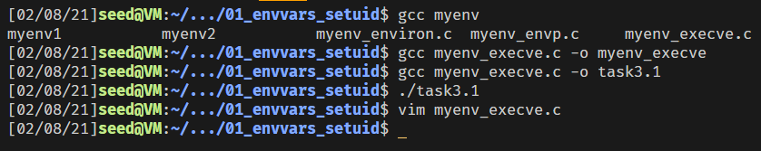

### Task 3.2/3.3
When the code is changed to `execve(argv[0], argv, environ);` we actually get the enviroment variables of the current process printed. Im pretty sure that it is just getting a reference of the pointer to the environment and passing that into a function.

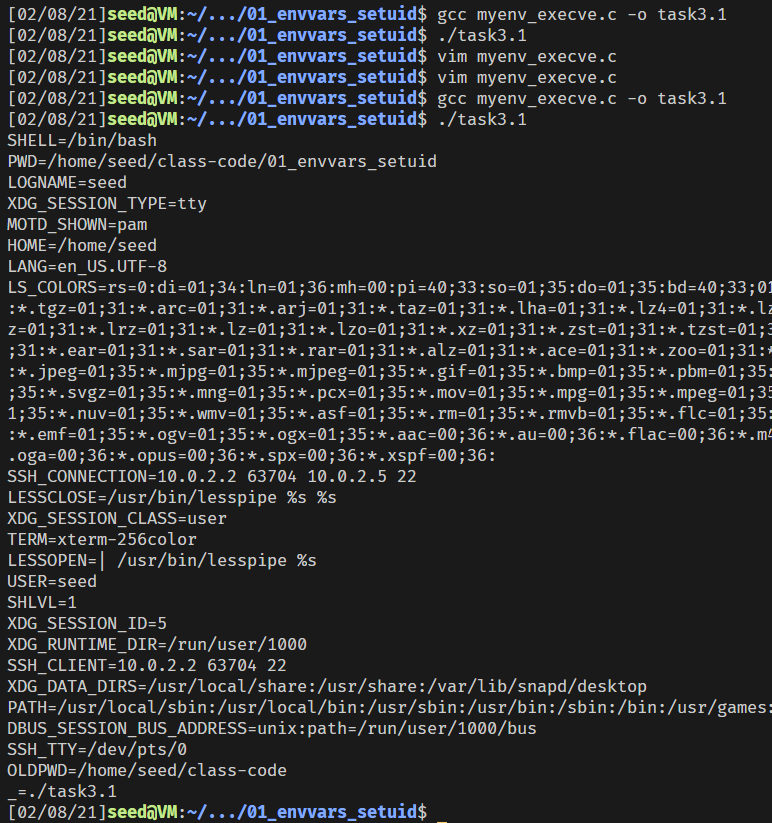

## Task 4: Environment Variables and `system()`
If we look at the screenshot output.

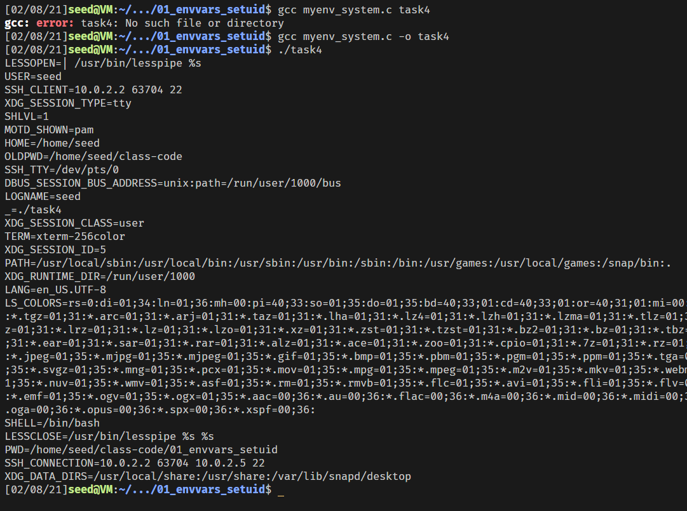

We see that the `shell =/bin/bash` which means that the `system()` externally calls the shell which in
turns executes the cmd.

## Task 5: Environ Vars and Set-UID Programs
All the environment variables are inherited except the `LD_LIBRARY`
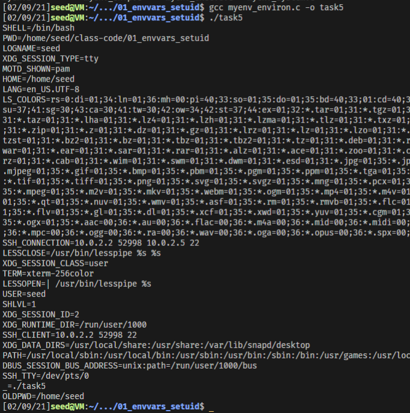
After further reading the `LD_LIBRARY_PATH` is ignored if a Set-UID program tries to access
it. This is a stop put in place by the OS to make it so bad files do not end up getting placed in the
shared libraries.

## Task 6: `PATH` and Set-UID Programs
Running the program before permissions get set nothing happened. After changing the ownership we get the Fake Ls to print
out.
I disabled the symbolic link but i still could not get my ls file to run.
I tried to name a file called `ls` thinking that the system call would encounter that file and 
attempt to run it but nothing happened for me.

## Task 7: `LD_PRELOAD` and Set-UID Programs
Once writing the `mylib.c` file we compile it and make a DLL we can set the
`LD_PRELOAD` environment variable with the export command after we execute the program
from the root account we can set the `LD_PRELOAD` to point to the DLL we had created earlier we can then make another user 
on the system to verify what the `LD_PRELOAD` is doing.
### Task 7.1
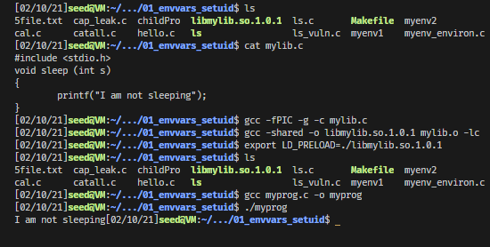

### Task 7.3
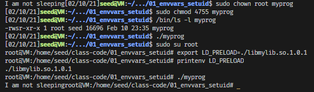

It look slike the `LD_PRELOAD` is ignored if it is being accessed by a Set-UID program.
Further reading indicates that this is a protection set in place by the OS.

## Task 8: `system()` vs `execve()`

### Task 8.1
After compiling the program and trying different things i think i have been beat,
i dont know how to delete files from he catall program.

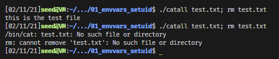

### Task 8.2 
I tried including it in a string but it tries to look for an entire file name "file.txt: rm file.txt" which 
does not work.
Then i tried appending it at the end like `./catall test.txt; rm test.txt` but it reads in the file and terminates the program.
We nkow that the system does not execute directly instead it calls the shell and then executes.
But with `execve()` the program that calls is replaced by the new program and that interprets the string that was passed in 
literally and treats everything after `;` as a new command losing the root privilege

## Task 9: Capability Leaking
Once we comile the program and then make it a Set-UID. We can change the user to root and create the file zzz under the etc directory. Then we go back and run the program, looking at the file it appears that it was compromised by using the child process to write to the file.

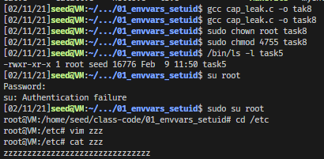

After some further reading it appears that the file permissions are also passed down to the child process, so since the parent had access to the file so did the child. To stop this type of thing from happening you would have to make sure to remove those permission before you fork off a process.