# Systems and Software
# Kade, Pitsch(t12r458)
# kadecarter82@gmail.com
# CSCI 476
# 02/16/2021

## Task 1: Experimenting with bash functions.
The reason why this tells us whether the program is vulnerable or not is because a vulnerable program will keep reading in as a string even after the "program" has reached it's end. Letting us implant an echo statement. The patched version will not allow this.
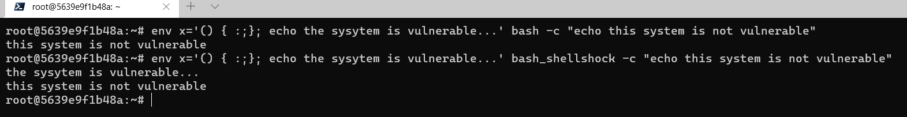

## Task 2: Passing Data to bash via Environment Variables.
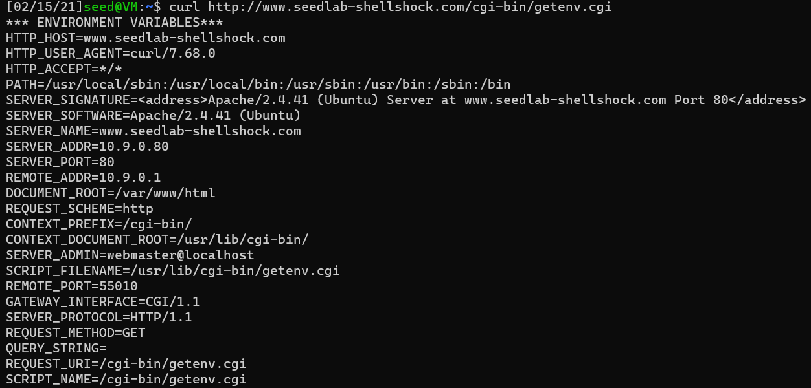

### Task 2.1: Passing data via the Browser.
The environment variables that we can pass in via browser are
* HTTP_HOST
* HTTP_USER_AGENT
* HTTP_ACCEPT

### Task 2.2: Passing Data via `curl`

>Task 2.2.1: The `-v` option
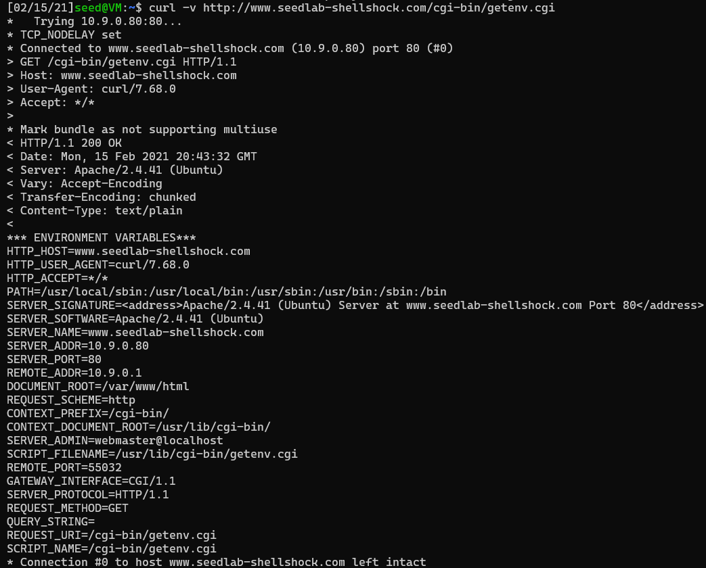

>Task 2.2.2: The `-A` option
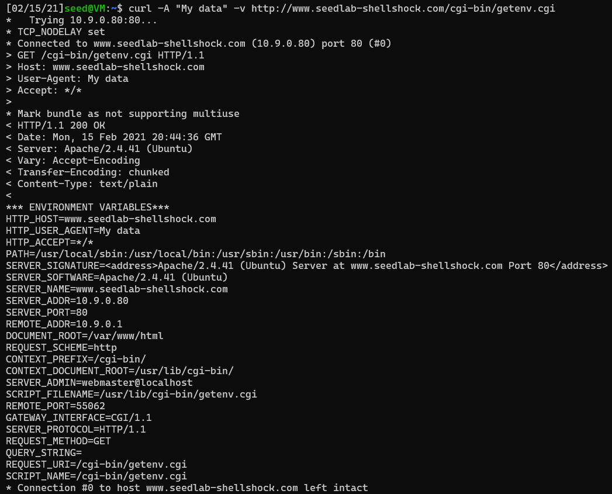

>Task 2.2.3: The `-e` option
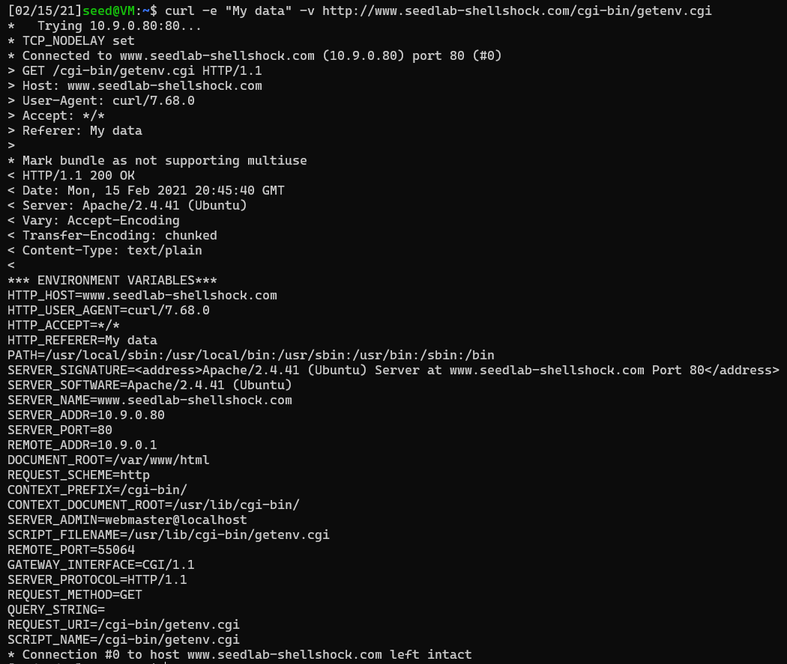

>Task 2.2.4: The `-H` option
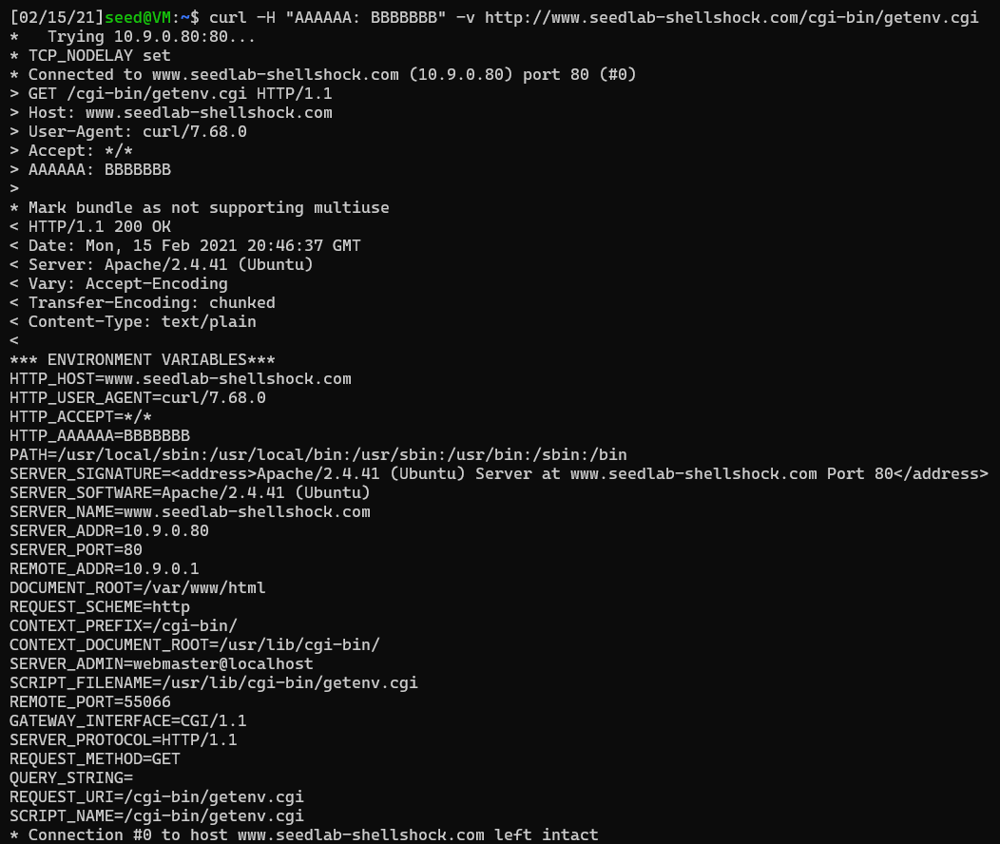

### Task 2.2.5: Developing an Attack Strategy.
I think that we can use the `curl` command to set the `HTTP` headers to a shellshock style attack. The headers can be set via the `-A` command. Since these fields are set by the internal CGI program we can target it with a shellshock attack if it were still vulnerable.

## Task 3: Launching the Shellshock Attack.

### Task 3.1: Shellshock & Reading a File.
If we can execute regular bash commands like echo via the shellshock attack then we should be able to execute any command. This took awhile to figure out as i was just calling any command directly like `... cat /etc/passwd;`
but that was not working util i specified where those commands are located, then they started working.
`... bin/cat /etc/passwd;`
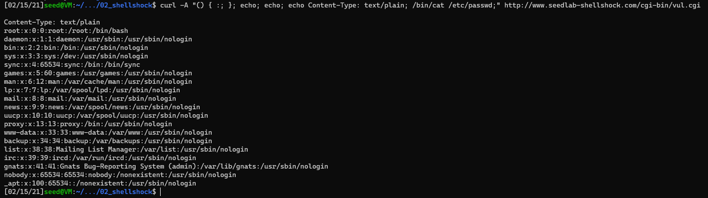

### Task 3.3: Shellshock & Creating a File.
The same is true for this task, once i specified where the command was located it worked perfectly.
We can even locate the file with the same style attack
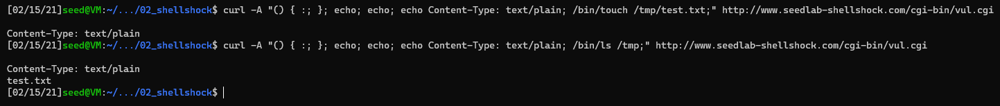

### Task 3.4: Shellshock & Deleting a File.
Using the shellshock attack to delete a file from the server.

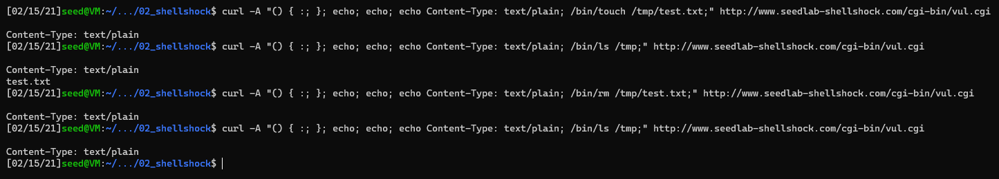

Checking docker to see if it truly worked

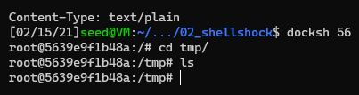

Looks like it did

## Task 4: Getting a Reverse Shell via Shellshock
In the reverse shell attack we can set up an attack by listening on a port for a connection once a connection is established we can redirect the input to the output destination server. Once we have that connection we can just ask the host shell to execute our commands

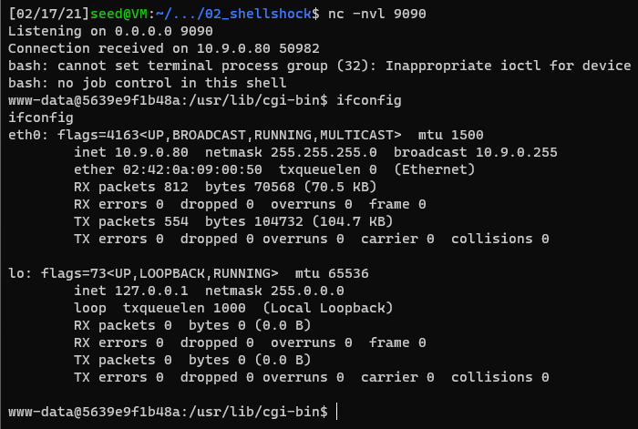

Here we can see that our connection was waiting for a request and once we got it we can run `ifconfig` to verify we have the proper connection

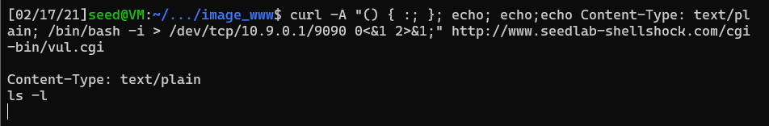

From the servers perspective we ran the curl command with the "malicious" code.

## Task 5: Using the patched bash
Verifying that the changes were made

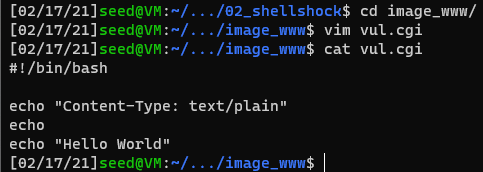

From what i can tell, it looks like the `/bin/ls -l` command still gives us the same output which makes me think that nothing changed. I would have expected that nothing would have been output if we are running the patched shell.

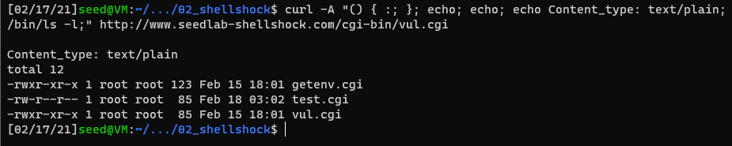
