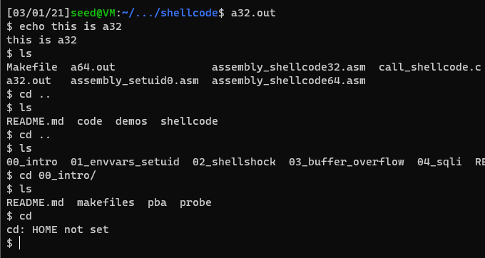
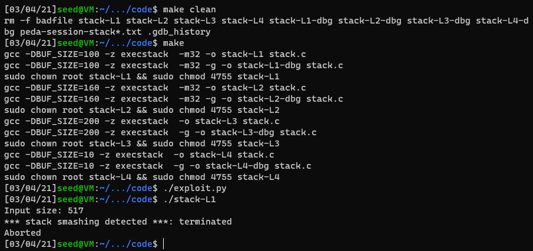

# Systems and Software
# Kade, Pitsch(t12r458)
# kadecarter82@gmail.com
# CSCI 476
# 02/16/2021

## Task 1: Getting familiar with shellcode

### Task 1.1: Compile both programs.

These programs are just programs that are written in assembly to place shellcode on the stack.

### Task 1.2: Describe what the program is doing

It looks like the code has an open char array that we can consider our
"buffer" that accepts 500 char input
and then it copies that input to another char array where this is input to 
a function that sends it to the correct 32 or 64 bit shell.

## Task 2: Attacking a vulnerable 32-bit Program.

### Task 2.1: Finding the return address.
After following along to the `gdb` tutorial on the lab i was able to locate the `ebp` and `buffer` address which we subtracted to get the offset.

The offset is what we needed to know where to place the return address. Mine was the same as Travis's `108`

### Task 2.2: Launching the Attack
Making sure that we have the right(um wrong i guess)
permissions set so we can attack the system.
No random addresses and making sure our shell is pointing to the ~~wrong~~ right one

Then we need to change the values in the `exploit.py` file

The first thing i had to do was put in the correct shellcode which was just copied in from the `/shellcode` directory/file.
Then i had to decide where the payload was placed.
We know that the the allocated size being read in was 517 and we do not want to place the payload at the very end because we need to hit the `NOP` sled above it to *'slide'* into the malicious code.
The code that decides that is the `start = 400 - len(shellcode)` which just tells the program that we know how long our shell code is so place it here in the `NOP` array.
then we have our `ebp` and `buffer` addresses stored in the file for ease of use. So we take our `ebp` address and add `0x98` which was really hard to figure out. I was trying values here over and over and over until i tried one that gave me an illegal instruction error which was better than a segfault. Which later figured out that the instruction had to be aligned by a multiple of 4 which then after iterating over larger and larger sizes it worked with `0x98` which makes sense as thats where our target is that we need to land in to slide into the malicious code. Then we place that return address in the location of our offset to make sure we are exceeding the length before the other values to overwrite.

After several trial and error runs i was able to get the shell to launch from the malicious code. You can see in the image attached above that we successfully got to the shell :)

## Task 3: Attack w/o knowing the buffer size.
After altering the code in `exploit.py` and several attempts where i figured my first option would be a for loop to attempt buffer sizes but the lab explicitly states that a brute force style attack would not receive full credit so this is still a W.I.P

## Task 4: Defeating `dash`

### Task 4.1: w/o setuid(0)
Here we run the programs with the original configuration and we can see that the `uid = 1000` which informs us that this is a non-root program

### Task 4.1: w/setuid(0)
After changing the `call_shellcode.c` to set the id to 0 we recompile the programs and get the `uid=0` which informs us that the programs are now root.

### Task 4.2: Lauch the attack again.

After we updated the shellcode to `setuid(0)` we can see that we launched the attack again and got the root shell

## Task 5: Defeating ASLR

### Task 5.1: Attack w/ASLR on
We can see that after turning stack and heap randomization back on that our attack no longer works because our program has no idea where the correct area is to place the return address and we no longer have the means to calculate it.

### Task 5.2

Our brute force attack took 1 minute and 32 seconds with 34,131 iterations

## Task 6: Other countermeasures

### Task 6.1: Stackguard

Here we have the original code with the protection off

We run the attack again and it obviously still works

Then we turn that protection back on since it is enabled by default

And we can see that our exploit no longer works

### Task 6.2: Turn on the nonexec protection

Below you can see that we have removed the `-z execstack` flag from the makefile 

And below you can see that our programs no longer execute because we are no longer allowed to place shellcode directly on the stack.
