# Systems and Software
# Kade, Pitsch(t12r458)
# kadecarter82@gmail.com
# CSCI 476

# 03/07/2021

## Task 1: Getting familiar w/SQL

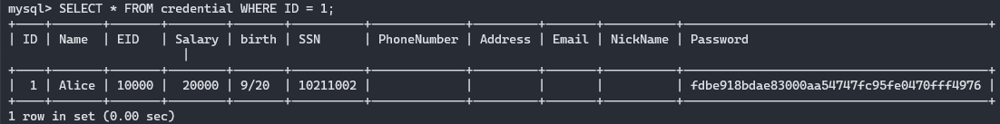

## Task 2: SQL injection on SELECT statement.
Tried opening the link on my local machine for like 10 minutes...figured out it only works from the VM so that was cool :).

### Task 2.1: SQL injection from login
At first i just attempted to put a `SELECT` statement in the password to retrieve the password, but that obviously did not work

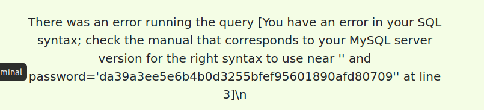

After reading through the source code we want to take advantage of the `WHERE` command and what i chose to do is to input ` ' or Name = 'admin';# ` where the first open quote closes the command before it which is the `name = ` command, then the program can start reading our *malicious* input. Their first command was ignored from our implanted open quote so we can say ` OR Name = 'admin';` but that alone would not work. SQL also accepts comments so if we place a hashtag at the end of our statement it ignores everything after it so we do not even need to enter a password!

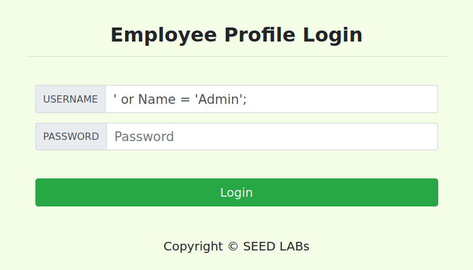

### Task 2.2: SQL Injection from CMD line

### Task 2.3: Append a new SQL statement.
Reding up on prepared statements it looks like this will not be possible. You are not allowed to chain multiple SQL statements from a PHP program. Which is what the DB backend is written in. So we will not be able to append a new statement into the fields via GUI or the `curl` command.

## Task 3: SQL injection on UPDATE statement.

### Task 3.1: Modify your salary.

This attack is pretty similar to the former attacks. We can just close the nickname statement and insert our own ignoring the rest.
The command used was `', salary='999999999' WHERE Name = 'Alice';#` we have the closing quote in the beginning and then we have the comma because that is how the function is structured. Then we increase the salary for Alice.

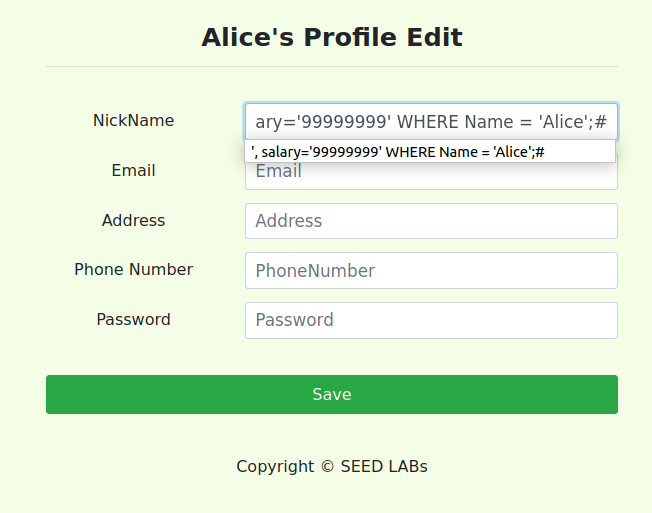

Here we can see the change was actually applied.

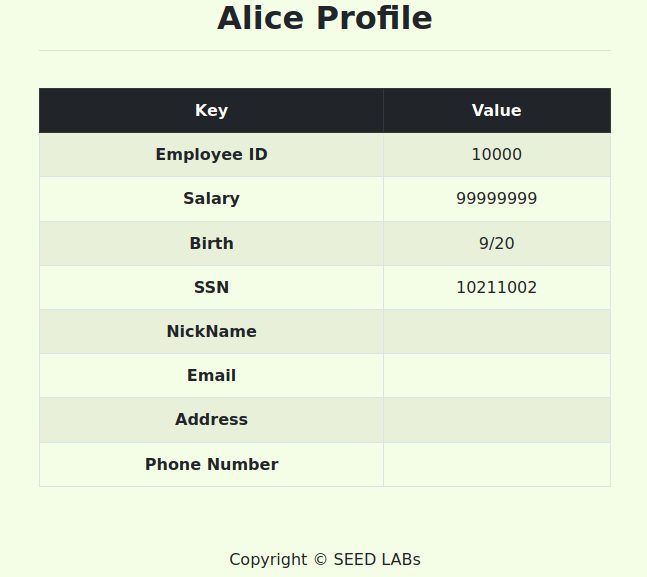

### Task 3.2: Modifying Samy's salary.

We can do the same thing with this attack, just changing the values
`', salary='1' WHERE Name = 'Samy';#`

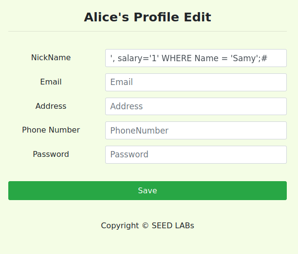

Here we can see that it also applied the change

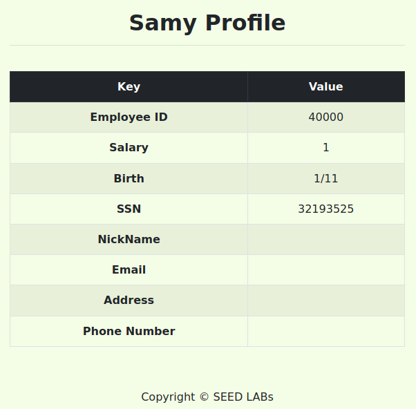

### Task 3.3: Modify the password of others.

Since the program encodes the password in `SHA-1` i assumed that we can just bypass that part by passing in the password as already encrypted in`SHA-1`

Here Alice is mad so she is changing samy's password to 'samysuxs' getting the encrypted value and going to attempt passing that in.

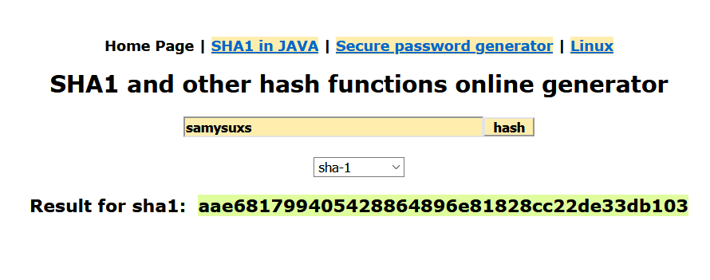

Attempting the attack

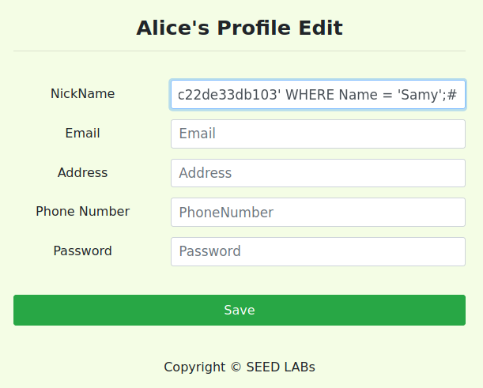

Here we can see that the hash values of the password match, so we succesfully changed the password to samysuxs
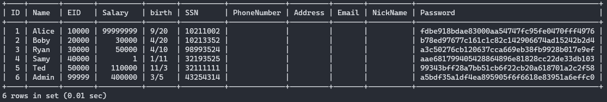

## Task 4: SQLi Countermeasure: Prep. Statements.
After researching the prepared statements for a little bit and looking over the PHP code that was provided i changed the code and attempted a lot of revisions but i could not get it to display the content of the sql select query. I have never worked with PHP before and do not really understand what was going on.

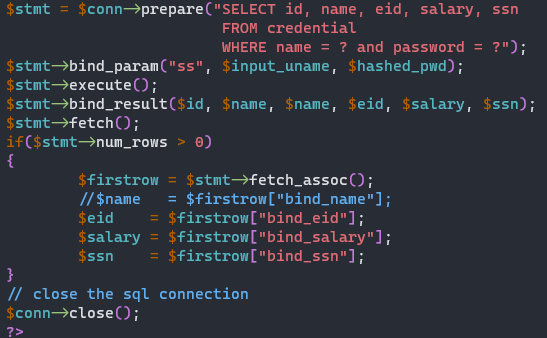

This was my code for the PHP program.

