# Secret-Key Encryption 
# Kade, Pitsch(t12r458)
# kadecarter82@gmail.com
# CSCI 476

# 04/02/2021 

## Task 1: Encryption Cipher and Modes.
Here is the list of ```openssl``` supported ciphers.

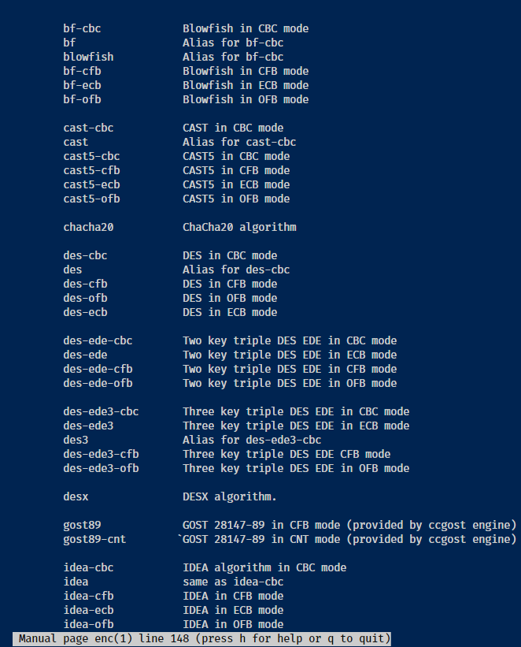
Encrypting files using **```blowfish```** and **```sm4```**
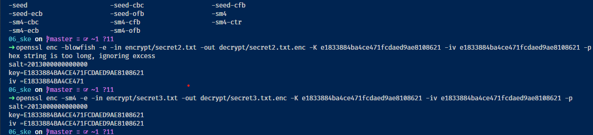
I forgot to screenshot the 3rd one but i guess i successfully encrypted the image files for task 2 so this is my stand in for the 3rd file using
**```**-aes-256-ctr```**
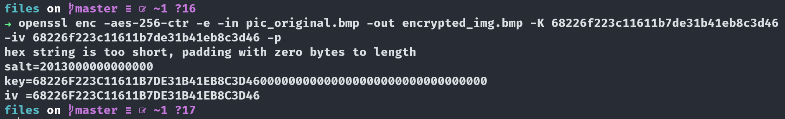

## Task 2: Comparing Encryption Modes

### Task 2.1
#### Here we can see what the original image looks like.
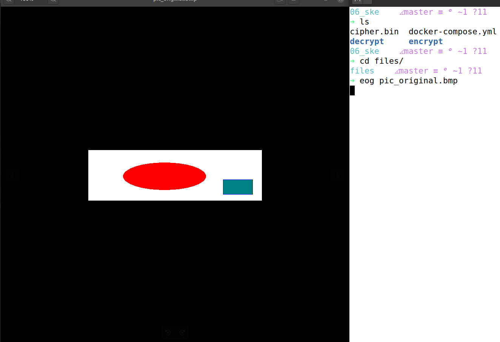

------------------------

#### Encryption of the file


--------------------

#### Viewing the file after encryption
I used a different method to get the header of the header from the original file. ```dd if=originalImg of=encodedImage bs=54 count=1 conv=nottrunc```
which is just reading the first 54 inclusive bytes of the file and overwriting that on the encoded image. 

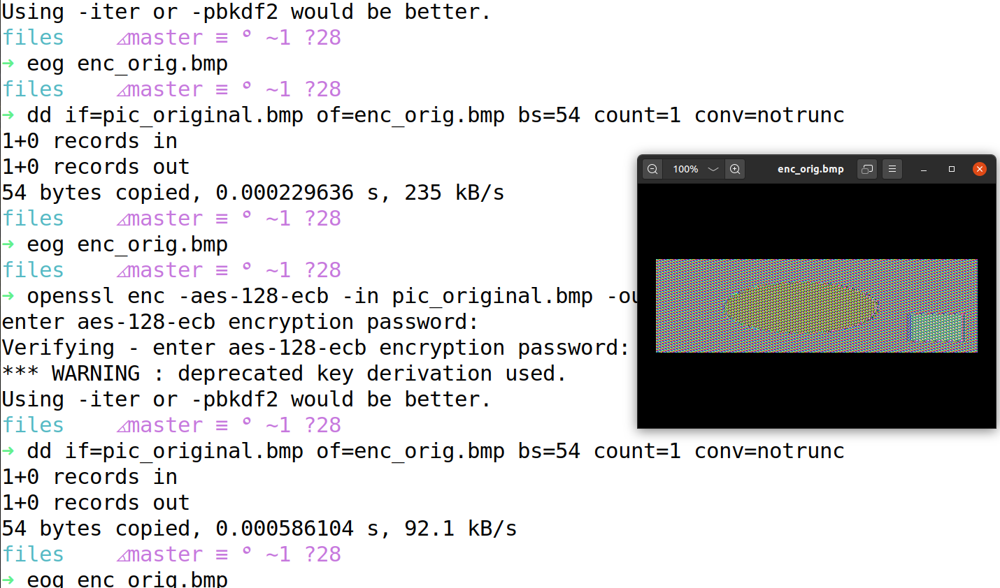

### Using CBC to Encrypt the file
#### **1** ) i used the same ```dd if...``` method previously
#### **2** ) we can see that CBC did a way better job at not leaking any info.

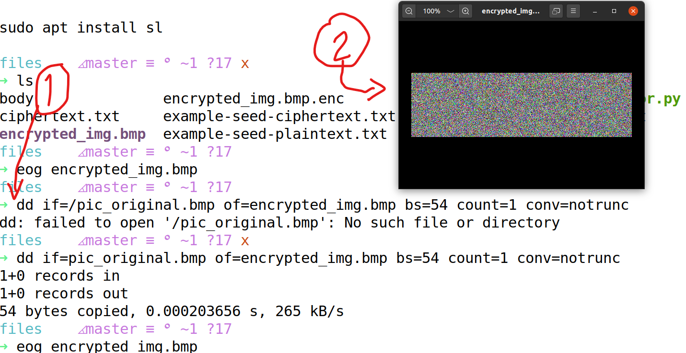

### Repeating W/my own image
#### Here is the original image, just found a random .bmp file online.
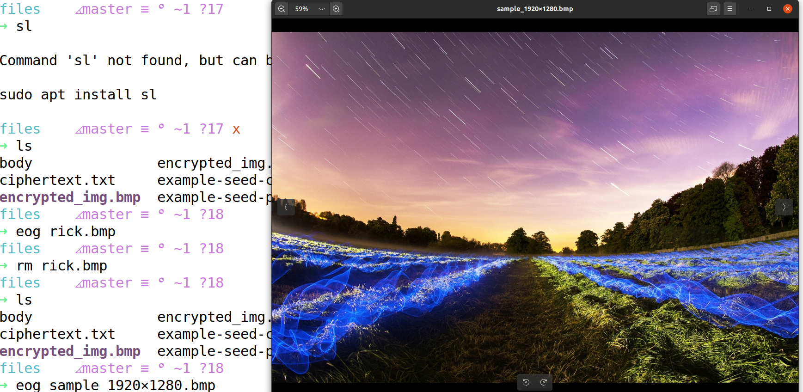

#### Using the ECB method i thought that more image info would be leaked but maybe its too high resolution so it has more info to mix up. There are some artifacts in the middle left and right but nothing major


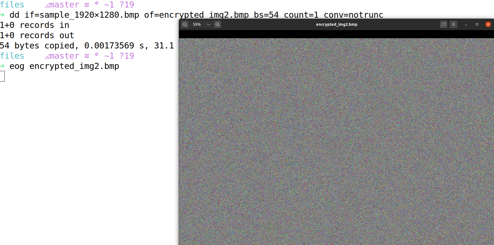

#### Using the CBC method looks pretty similar to the EBC method
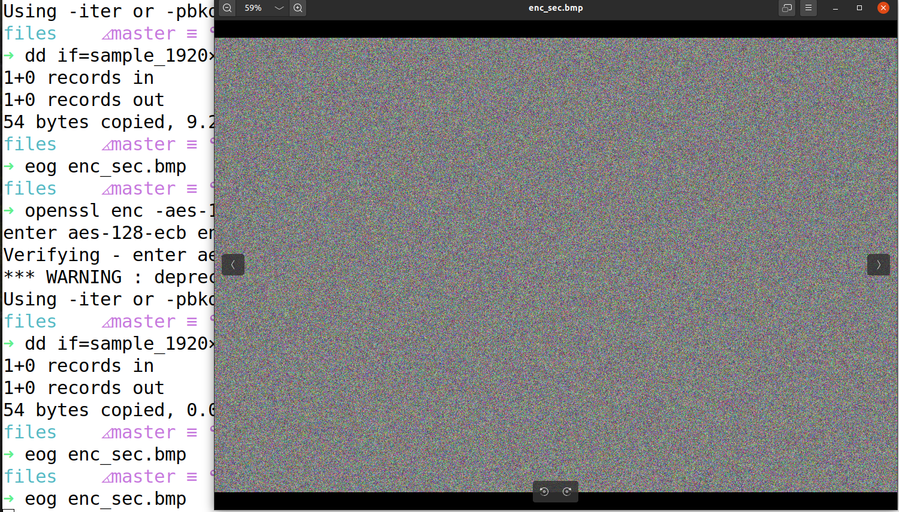

## Task 3: Padding
### Task 3.1
Here we can see the size of the files in bytes that were created. 

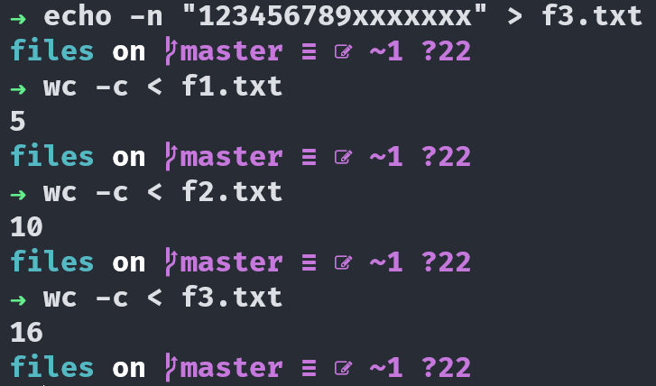

The ```CBC``` mode uses padding
Here we can see the size of the files in bytes after encrypting them.
This is a common practice for encryption called padding. Where the algorithm is adding fluff to the file to make it more ambiguous.

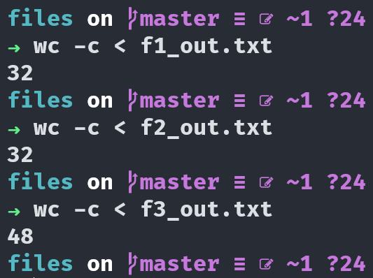

The ```ECB``` mode also uses padding. This is because it is only capable of encrypting data in multiples of the block-size.

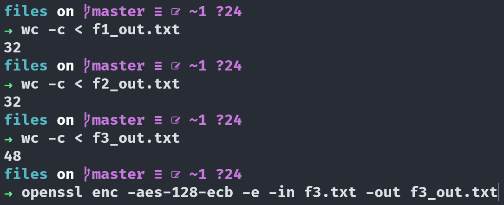

The ```CFB``` method does not use padding

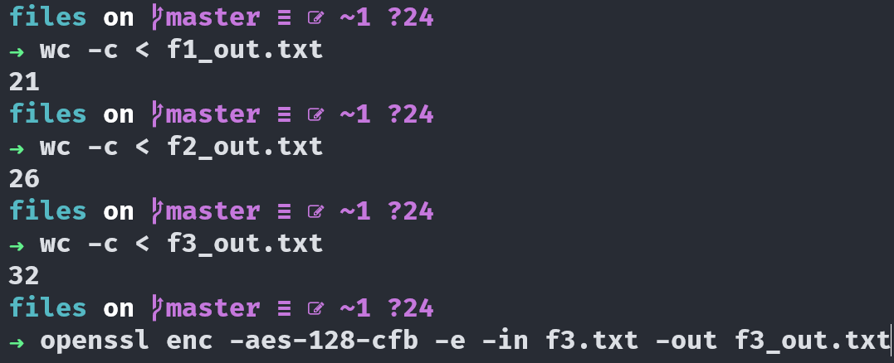

The ```OFB``` method also does not use padding

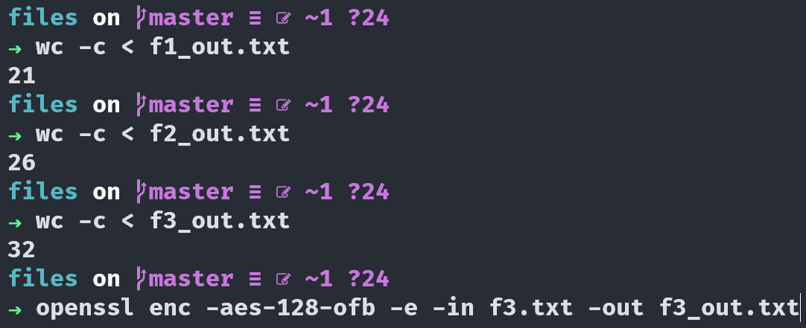

The way that ```CFB & OFB``` work and why they do not need padding is because they are both streaming modes of encryption where the other two were deterministic. Streaming works by feeding back into itself therefore the blocks can be different sizes and not need padding.


## Task 4: Error Propagation & Corrupted Cipher-text

## Task 4.1: Predictions
After reading up on the encryption methods it looks like 
| Method | Amount Recoverable                  |
| ------ | ----------------------------------- |
| ECB    | Everything except 1 corrupted block |
| CBC    | Everything XOR 2 corrupted blocks   |
| CFB    | Everything XOR 2 corrupted blocks   |
| OFB    | Everything except 1 corrupted block |


### Task 4.2: ECB & Data Corruption
We can see that only one block was not recoverable. The way that ECB works is that a block of plain text get fed directly into a block cipher so only that one block would be corrupted. Since there is no "chaining" in ECB the only block that will be effected by the corruption will be the corrupted block.

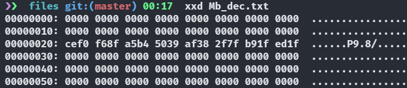

### Task 4.3: CBC & Data Corruption
With CBC using XOR's to calculate the next blocks IV, the max number of blocks that can be corrupted is 2

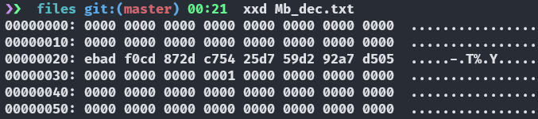

### Task 4.4: CFB & Data Corruption
The CFB works similarly to the CBC and feeds that next cipher plaintext that has an XOR operator so the next block could also get corrupted.

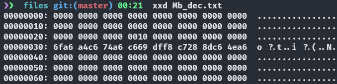

### Task 4.5: OFB & Data Corruption
This is also similar to CBC abd CFB but the XOR happen after it chains to the next block so only one block will be corrupted.

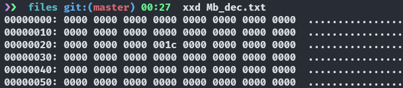

## Task 5: Common Mistakes with IV's

### Task 5.1: Unique IV's
For the image below we used the same IV in both encrypted texts and maybe i should have used similar text files but i just used the ```dd if=/dev/zero of=name_of_file bs=file_size_in_bytes count=1``` to make two files of 64 bytes. I know that if we use the same IV for encrypting files that any prefixes in the file will be the same in each file so they could be vulnerable to frequency analysis.

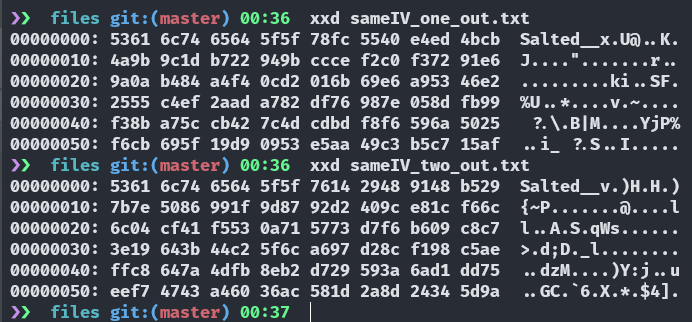

Using different values for the IV's i could not find any similarities between the files so i guess that is a good thing!

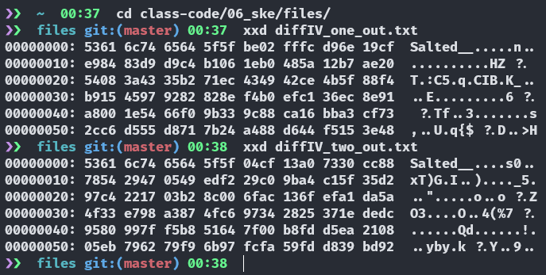