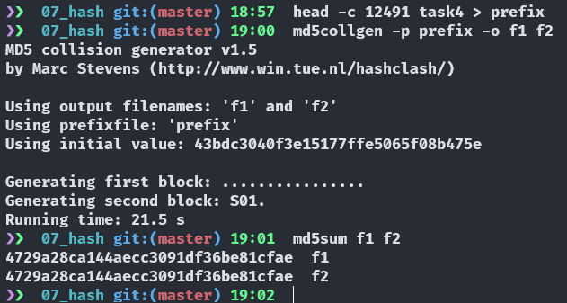
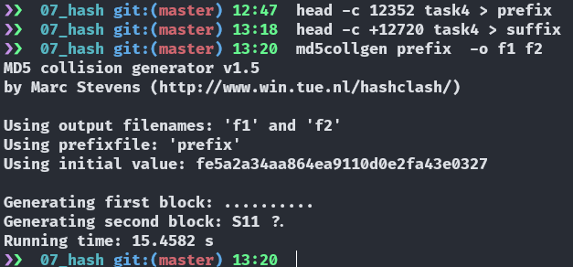
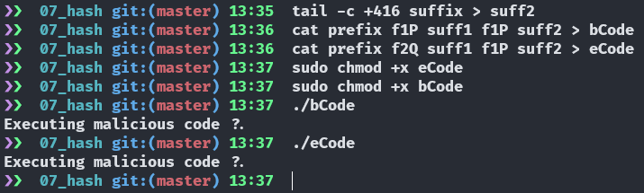

# MD5 Collision Attack Lab
# Kade, Pitsch(t12r458)
# kadecarter82@gmail.com
# CSCI 476

# 04/10/2021 


## Task 1: Generating Two Different Files w/the same MD5 Hash

### Task 1.1
Here we create the files using the ```md5collgen``` command, and i changed the prefix file to say this is kades custom message...


It looks like the files differ slightly. specifically the ```c.........)``` in the top file is ```c..?.*....)``` in the bottom file.


### Task 1.2
When the prefix file is not a multiple of 64 we have 0 padding to compensate

Here i created a file that is not a multiple of 64 and we can see the added padding at the end.

### Task 1.3
When the prefix file is a multiple of 64 we get no 0's padding


### Task 1.4
Here We can see the difference between the two files. It is kinda hard to see but i just piped the output of ```xxd``` to a normal .txt file so the differences are going to be double. Hex diff on the left of each file and text diff on the right of each file. Looking at the hex red is the difference and pink is the same. So there is a few differences.


## Task 2: Understandiong MD5's "Suffix Extension" Property
Here we create two files ```out1 & out2``` then we check their hashes and they are the same. I created two files and appended them to the ```out1 & out2``` files then checked their hashed again to see that they still have the same hash.


## Task 3: Generating Two Executable Files with the same MD5 Hash
Using the Bless hex editor we can see that our array of A's exists in the binary from 0x3020(Decimal 12320) to 0x30e8(Decimal 12520) we can use this information to split our data roughly in half at 0x3074(Decimal 12404).


Where our array of A'a exist in the hex file.
After finding this out i had to run the provided commands like ``` head & tail ``` to split the file where i needed to. Getting the two versions of the original file.


In the image below you can see the two programs compiling. We can pipe the output to a txt file and run diff seeing that the output is different. They do differ somewhere but then i check the hashes and they are the same


## Task 4: Making the Two Programs Behave Differently
Array one starts at 0x3020(Decimal 12320) placing the data in the middle of the array at position 0x3040(Decimal 12352) Which is also divisible by 64. Then we want to get everything that is after the first array which is 0x31b0(Decimal 12720) Then we need the position of array 2 which is 0x31c0(Decimal 12736)
After locating the length of the prefix i split the file at that location. and checked the hash of the two generated files. They are the same



Here i found the the beginning of the array in the suffix file and then split the head. I see that i made a mistake and called head twice so i am sure that is where i was going wrong



After several attempts at splitting the file by head and tail i could only get the malicious code to execute



 I am not sure what i am doing wrong, just needed to spend more time on thic portion.