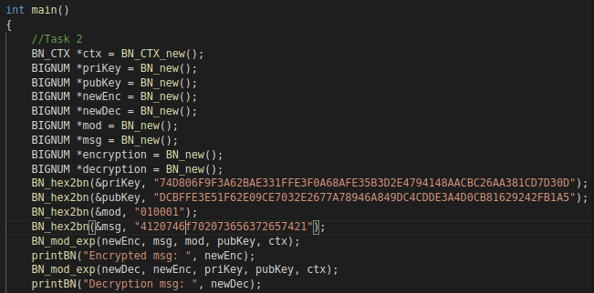

# RSA Public-Key Encryption and Signature Lab
# Kade, Pitsch(t12r458)
# kadecarter82@gmail.com
# CSCI 476

# 04/10/2021

## Task 1: Deriving the Private Key
Here is the code that i used for the Eulers formula to derive the private key


After using the provided ```p q and e``` this is the key that was derived.

## Task 2: Encrypting a Message
After setting the values that were provided we can start the encryption.
To encrypt the 'A top secret!' we need to convert the number to hex.
Then convert this hex number to BIGNUMBER.
To encrypt we call ```BN_mod_exp``` which is equivalent to ```message^mod(mod public key)```
Then we need to decrypt this message in the same way.
Which is equivalent to ```(encrypted message ^ mod) ^ public key```



After applying those methods we get the output after decoding the hex with python


## Task 3: Decrypting a message
This part was pretty simple. 
all we had to do was skip the encryption step and replace the value of ```newEnc``` portion with the hex value that was provided.


Here is the decode hex from python, looks like it works

