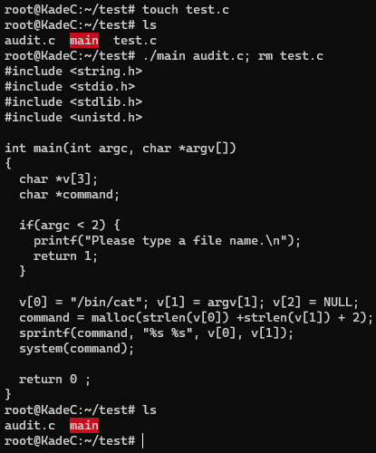
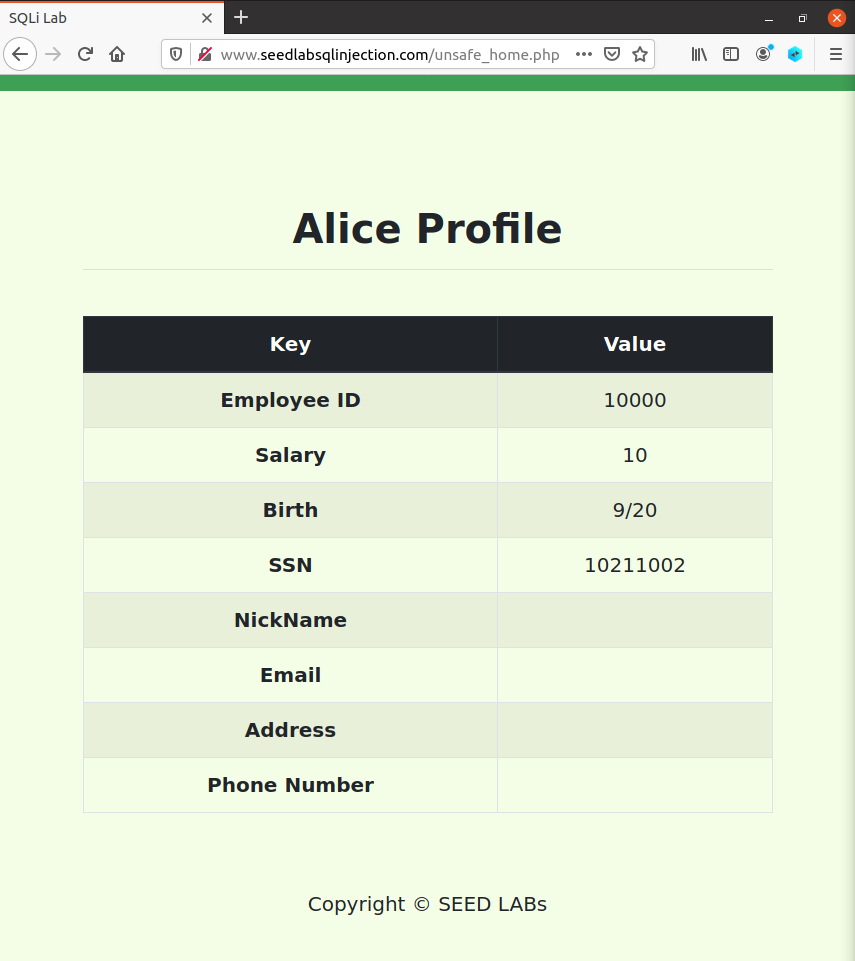
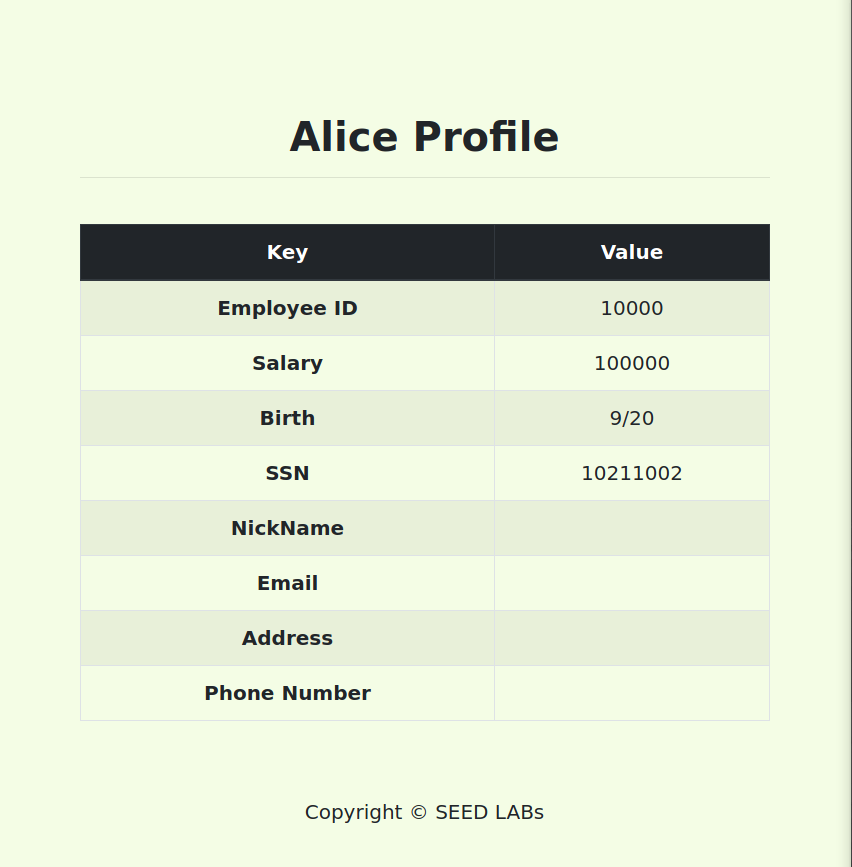
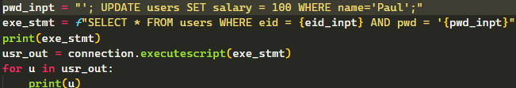
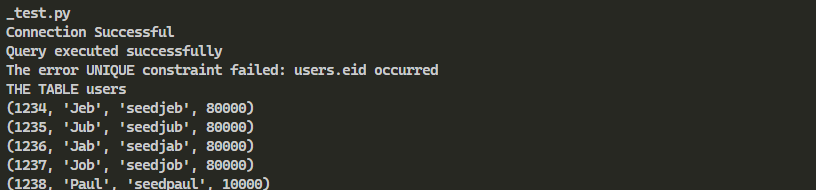
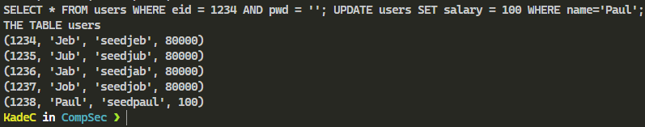

# Lab 09: Final lab
# Kade, Pitsch(t12r458)
# kadecarter82@gmail.com
# CSCI 476

# 04/23/2021

## Statement Of Academic Honesty
### I, Kade Pitsch (t12r458) agree that the solutions presented below are entirely my own. If I have used resources that are not my own, I have includes appropriate citations.

## Task 1: Short Answer
### Task 1.1
The problem with system() calls the shell to execute the given command and that shell could have elevated privileges whereas execve() replaces the entire program with the one being called. Also system() can execute any command which can lead to a whole bunch of other issues.
### Task 1.2
A vulnerable shell and a web-server with CGI enabled. From Lab 2
### Task 1.3
Looks like `nc -l 7070` is listening on port `7070` then `/bin/cat` will invoke a cat command which is being fed `/dev/tcp/10.0.2.6/7070` which then also get the file descriptor `&0` redirected to it which is the stdin. I believe this is a reverse like shell. Any traffic that is going through `10.0.2.7` on port `7070` is getting printed to the `10.0.2.6` computers terminal
### Task 1.4
ASLR is Address Space Layout Randomization, this makes buffer overflow more difficult by randomizing the starting address of the heap and stack which makes it really hard to guess the exact addresses of where the payload need to end up. Lab 3
### Task 1.5
Dynamic content being sent over the web without being verified.
### Task 1.6
Reflected attacks are injected scripts that are reflected from the web server and they can appear as an error message or other things like that. These attacks usually come from a email or form that the user would fill out and then they are executed because they are coming from a trusted source.
Stored Attacks are the type of attacks that we performed in lab 5 where the information was actually being stored on the user's profile page
### Task 1.7
Since Bob generated the y key which is `g^y mod p` and Alice generated the x key `g^x mod p` Bob receives the x key and Alice receives the y key. so for bob `k_x = g^x mod p` and Alice `k_y = g^y mod p` since these two keys are algebraically equivalent then they will get the same 'shared secret' 
### Task 1.8
Hybrid Cryptography is more secure and resistant to certain eavesdropping techniques. 
Also Hybrid encryption can be faster to use after establishing a connection channel 
### Task 1.9
Locates them in the /bin file and executes the command associated with that name. I am sure with enough work some one could mess with the hex files and changes something in those files.
### Task 1.10
1. I think the most obvious counter-measure would to be write more secure code and you could do this by coding in Rust instead of C ;). But that would be the most beneficial strategy, just write better more secure code. strcpy() performs no bound checking so if you did not know the pitfalls of using this you could overflow your buffer.
2. Make it so the stack can not execute code. According to the article i was reading, this is not an easy task. GCC uses something called trampoline function which takes the address of a nested function that works on the sys. stack being executed. 
3. Compilation Tools to offer check and optimization to the code before they get pushed to production. GCC does some of this by letting you know that you are using a deprecated function. Other tools like StackShield and StackGuard.
## Task 2: Guest Visit Questions
### Task 2.1: Security In The Real World: Crypto
For this task i think that it would be the easiest to have a <key> node that stores the method of encryption we have used for the <data> node. This could make the stored <data> node
way more secure because the key does not have to be stored literally. It could contain an alias to the method of encryption so we have a further veil over what and how is being encrypted.
As long as the decrypter knows what method of decryption to use we can always decrypt the <data> node. I think it would be the easiest to use an AES flavored encryption technique to store the <key> node because it is faster and if we paired AES with something like OFB then we would only lose one block if this portion got corrupted. Since this is just an alias to the real method of encryption i think it would be fairly easy to circumvent a bigger issue from this. I think the biggest con to this is probably over complicating a rather simple solution.
### Task 2.2: Security In The Real World: Compliance
1. Compliance is just a way to make sure all the systems in check. Making sure that if you are building an application you need to be sure that the methods you implement will be safe and secure.
2. A compliance framework is a strict set of guidelines that compile all the requirements that a company may require.
3. I just viewed the STIG viewer that Reese had presented in his lecture. Specifically looking at compliance checks in Canonical Ubuntu 16.04. I am just going to do one of each severity level. High, Medium and Low.
   1. **High:** A File Transfer Protocol(FTP) server package must not be installed unless needed. This check helps ensuring that an unsecured protocol like FTP is not used and instead replaced by something like ssh. This protects confidential information from being leaked
   2. **Medium:** Advanced package Tool(APT) must remove all software components after updated versions have been installed. This can cause issues because if an old version of the software had security issues than they could be exploited even after you have updated that program. This seems like a big check on compliance because as much as you can do on your system to ensure that things remain safe. It is probably more difficult to ensure the software being installed to that system is safe. Ensuring that bad things get removed seems like a good box to check
   3. **Low:** The Ubuntu operating system must use a separate file system for `/var`. This is a compliance safety check because by specifically uses a separate file sys. for the different paths help protect the system from failing. This ensures compliance because it is a simple check that makes sure that you don't overflow you file system. 
## Task 3: I Got 99 Problems But Auditing Ain't One
### Task 3.1
At a high level `audit.c` in the arg vector we set the first arg to `"/bin/cat"` then the second arg is the file path that was specified by the user. Then a NULL char is being read in and i am sure that is for the command to be terminated properly. Then we actually 'compile' the command on line 17 and 18. After that, we call `system(command)` which tells the program to `cat` out the contents of any file provided
Here would be the output of the program
``` c
./main allPasswords.txt
I hope no one can find this text file
Password1
Password2
Password3
Password4
```
### Task 3.2 
Since all that the program is doing is `cat`'ing out a file from the cmd line and since we are just reading in whatever is provide. We can read in something like `/some-file; rm importantFile.c;` and since it is calling the system with the same permissions that the `exe` file has the `rm` command will actually get executed.



### Task 3.3 
After reading through the man pages for `more` there was nothing that really jumped out to me to be able to exploit a program. I compiled it and tested things that i thought would work but no luck. I am not sure if this was the expected outcome. I researched the more command and i also could not find anything that would lead to an obvious exploit.


## Task 4: Inject This...
### Task 4.1 
I believe that this is a sufficient way to defeat a sql injection. If no key words are allowed and you can not escape the input by including a `'` in the input then i do not know what else you could do to carry out a sql injection. I know that this is probably not the best practice. It looks like if you want more security than using prepared statements is the best option. 
### Task 4.2 
This portion of code was exactly the same as a task in lab 4 so i just performed the same attack as i did in that lab.
The sql statement is the same code that is being used in `unsafe_home.php`


Here is Alice's salary before the attack.



Then we perform the attack using `', salary='100000' WHERE Name = 'Alice';#` 

Alice's salary after the attack.

### Task 4.3 
For this task i just decided to write a simple python program for it.
the code is included in the repo.

#### [Python SQLite Code](sql_test.py)

This uses similar syntax to the sql we used in class, idk what flavor we used in class was but i think this counts. 

Here is a screenshot of the code that i used for the program. 


The top two lines are where the magic is happening.

I was having issues implementing the attack. on the 4th line i was using `connection.execute(...)` which sqlite implemented some form of error checking where they only allowed you to run one command. After some research i found that you can bypass this with `connection.executescript(...)` which lets you chain sql commands. This is not a secure method but i think that is the point.

Here is the table that i am using for the task. Same format as the example in the Lab

Here is the table output again in the original form



and after running that chained sql command i was able to adjust Paul's salary. This would work if this was in a production software because i am doing no checking whatsoever and allowing multiple commands be chained together.




# fin 
## Sources


### Task 1.4 & 1.5 
<https://owasp.org/www-community/attacks/xss/>

---

### Task 1.7
<https://www.geeksforgeeks.org/implementation-diffie-hellman-algorithm/>

---

### Task 1.10
<https://www.linuxjournal.com/article/6701>

---

### Task 2.2
<https://www.stigviewer.com/stig/canonical_ubuntu_16.04_lts/>

---


