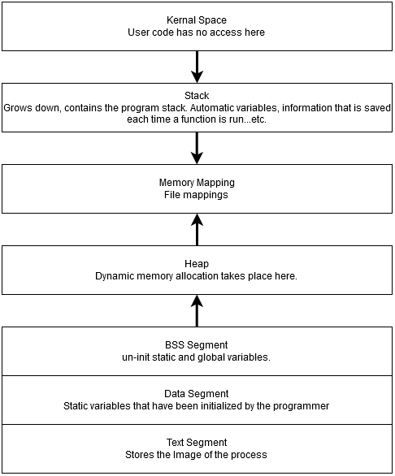

# Systems and Software
# Kade, Pitsch(t12r458)
# kadecarter82@gmail.com
# CSCI 476
# 02/02/2021
### Question One
Fork
: A fork simply creates a new process by copying the process that is calling it and this new process is called a child process.

Exec
: Exec is a little different from fork because it actually replaces the current process with a new one, starting from the point where it was called.

### Question Two

### Question Three
I think the reason for the distinction between program and code data is that we can not have full access to the program data from a developer perspective or making a program run would become very defficult because you would have to manually allocate memory for the program and the syste that it is running on without any checks and balances unless specified by the programmer. There needs to exist a seperation so things do not become unbound.

### Question Four
A big threat to be aware of would being able to get access to sertain parts of memory that you normally woul dnot be able to access. These can reveal very very important things if access could be gained.

### Question Five
A trust boundary is where data is passed between two processes. A location where the data changes its level of trust.

### Question Six
Stack Frame Pointer, Return Address and Function params.

### Question Seven
Main
: In a part of memory that is executable.

printf
: also located in the part of memory that is executable.

argv
: Placed onto the stack memory.

environ
: also placed onto the stack.

### Question Eight
Steps of complilation discussed in class were.
Preprocessor: resolves directives, .i files

Compiler: Invokes the actual compiler(cc, gcc, g++), .s files

Assembler: Produces machine code, .o files

Linker: to producde the executable files, this combines the .o files and libary files.