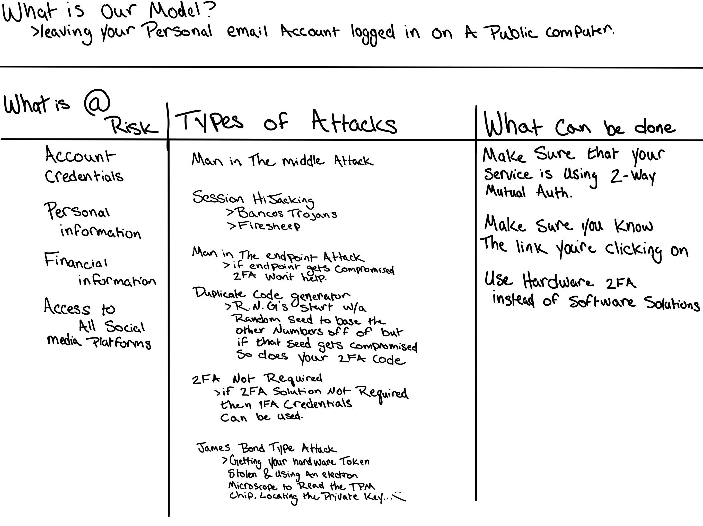

# CSCI 476
## Threat Model Assignment
## Kade Pitsch
## kadecarter82@gmail.com

### Overview
My model is about leaving your personal account logged in on a public computer with 2FA. In a perfect world this scenario every account that you have associated with that email is 2FA enabled/active. That does not mean that every account enforces you to actually use 2FA(although like i said, this hypothtical person is). That is important for this scenario because some sites offer 2FA but don't require it which can lead to other forms of attacks. 
I used a brain-storm approach because ~~I'm behind on the lectures~~ it seemed like the simplest approach and i actually ended up learning alot about 2FA. I started by just putting down what i actually knew about 2FA, knowing that it was not perfect and was also vulnerable to attack. Then i started researching ways to exploit 2FA which lead me to some weird discoveries about the technology involved. 

### Strengths
I think the strengths to my approach was that i chose something that i was only partially familiar with which let me learn more about the subject rather than a topic i knew more about which would not of been as fun.

### Weaknesses
The weakness of my approach is that it is not a formal model and i know i definitely missed certain things.

### Improvements
I think next time that i do a model like this is that i want to take a more formal approach so i can better cover all the aspects of the threat model. I also would like to improve the presentation of the information to be more intuitive.

### James Bond link(ITS REAL)

